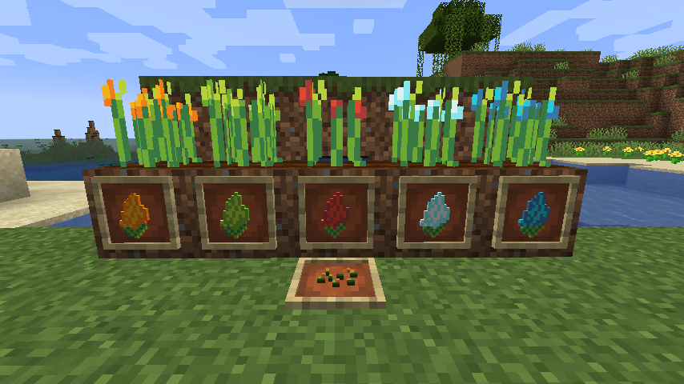

# Status Crops (Minecraft Fabric Mod)

Farm Status Effect Crops with Genetics™

## Each Status Fruit has a Positive and Negative Status Effect. 

But not every crops is the same and you can change it!

## Get Status Seeds from grass and ferns. There are 5 types of fruits

* Speed Status Fruit
* Mining Status Fruit
* Strength Status Fruit
* Jump Status Fruit
* Night Vision Status Fruit

## Using the power of Genetics, cross breed crops to improve stats and balance of the crops. Try to max all the stats

* Level: Max. 5
* Duration: Max. 5
* Balance: Max. 10

## My other mods

